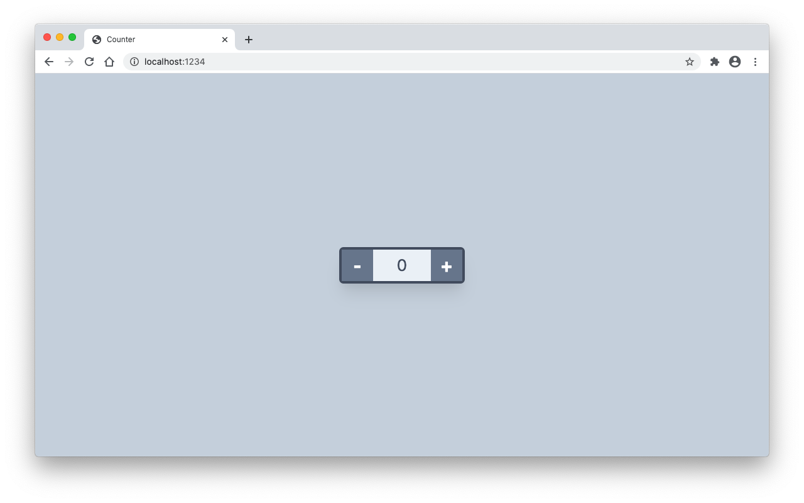

<div style="text-align:center"></div>

# Counter (LitElement)

This is a basic implementation of a counter using [LitElement](https://lit-element.polymer-project.org/).

## Live Demo

https://code.lucaseverett.dev/counter-lit-element/

## Getting Started

Clone this repo:

```sh
git clone https://github.com/lucaseverett/counter-lit-element.git
```

Install NPM dependencies:

```sh
npm install
```

Start dev server:

```sh
npm start
```

## Related Projects

[Counter (lit-html)](https://github.com/lucaseverett/counter-lit-html)

[Counter (React)](https://github.com/lucaseverett/counter-react)

[Counter (Solid)](https://github.com/lucaseverett/counter-solid)

[Counter (Svelte)](https://github.com/lucaseverett/counter-svelte)

[Counter (Vue)](https://github.com/lucaseverett/counter-vue)

[Counter (Vue JSX)](https://github.com/lucaseverett/counter-vue-jsx)
